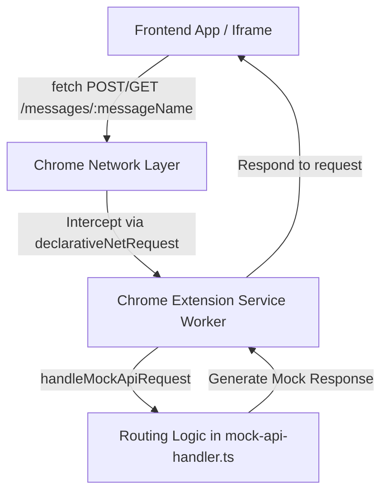

# Mock API Chrome Extension

A Chrome extension for frontend development that **intercepts API requests** to `https://vibe-cody.ai/api-mock/*` and dynamically responds with **playshot data**.

The extension supports:

* **GET** `/messages/:messageName` with query parameters
* **POST** `/messages/:messageName` with JSON or URL-encoded body
* **CE-User header** to simulate different users
* Works in **iframes**, including cross-origin, without changing frontend code
* Fully written in **TypeScript**

---

## Features

* **Dynamic routing:** Handle multiple endpoints with a simple router.
* **Request parsing:** Automatically parses body, query parameters, and `CE-User` header.
* **Extensible:** Add new endpoints, scenarios, or per-user state easily.
* **No frontend changes required:** Intercepts requests at the network layer using Chrome’s `declarativeNetRequest`.

---

## Project Structure

```
mock-api-extension/
├── manifest.json          # Chrome extension manifest
├── package.json           # npm scripts & dependencies
├── tsconfig.json          # TypeScript configuration
└── src/
    ├── service-worker.ts  # Service worker handling fetch events
    └── mock-api-handler.ts # Mock API routing & response logic
```

---

## Installation (Development)

1**Build the TypeScript code**

```bash
nx run vc-extension:build
```

This will compile all TypeScript files from `./src/` into `dist/vc-extension`.

4. **Load the extension in Chrome**

* Open Chrome → `chrome://extensions/`
* Enable **Developer mode** (top-right)
* Click **Load unpacked**
* Select the `dist/vc-extension` folder

5. **Test API requests**

```js
// GET example
fetch("https://vibe-cody.ai/api-mock/messages/hello?lang=en", {
  headers: { "CE-User": "user_42" }
});

// POST example
fetch("https://vibe-cody.ai/api-mock/messages/welcome", {
  method: "POST",
  headers: { 
    "Content-Type": "application/json",
    "CE-User": "user_42"
  },
  body: JSON.stringify({ text: "Hi!" })
});
```

You should see a JSON mock response from the extension.

---

## Building

To build the extension after changes:

```bash
npm run build
```

All compiled files will be output to the `dist/vc-extension` folder.

## Testing

To test the extension, run a static file server that serves `./tests/`

```bash
npx serve packages/vc-extension/tests/
```


---

## Customization

* **Adding new endpoints:** Edit `src/mock-api-handler.ts` and add a new route in `handleMockApiRequest`.
* **Simulating different users:** Use the `CE-User` header in requests.
* **Dynamic responses:** Implement custom logic in `handleGetMessage` or `handlePostMessage`.
* **Persistent state:** Use IndexedDB or `chrome.storage` for per-user scenarios.

---

## Notes

* The extension intercepts requests **network-wide**, including in cross-origin iframes.
* Only requests to `https://vibe-cody.ai/api-mock/*` are intercepted.
* Body parsing supports `application/json`, `application/x-www-form-urlencoded`, and `text/plain`.
* Other HTTP methods return `405 Method Not Allowed` by default.

---

## Request Flow Diagram



* **Frontend App / Iframe:** Any web app making API requests.
* **Chrome Network Layer:** Intercepts matching requests via `declarativeNetRequest`.
* **Service Worker:** Handles requests dynamically, parses body, query, and CE-User header.
* **Routing Logic:** Implements endpoint-specific logic and returns mocked responses.

## License
MIT License.
